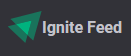
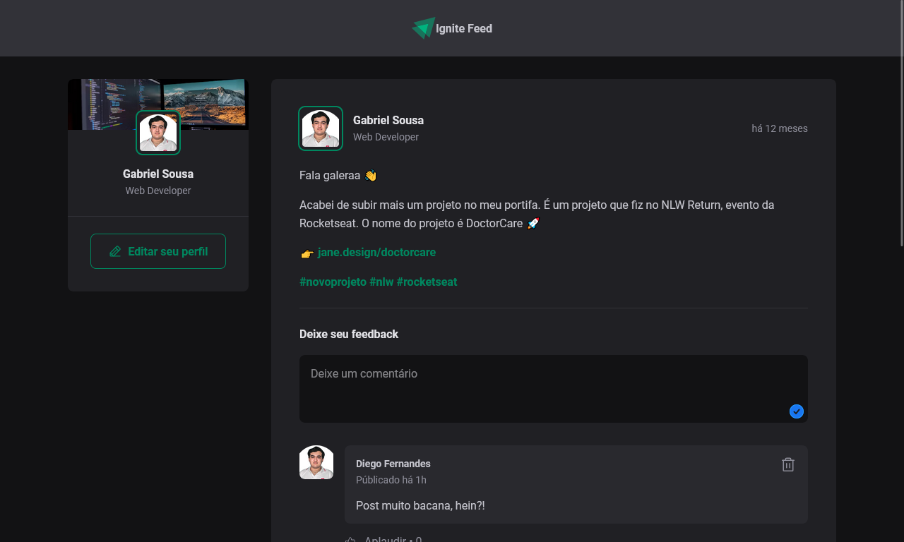

<h1 align="center">
  
</h1>

 

  

## 🚀 Tecnologias

Tecnologias utilizadas no projeto:

- ReactJS
- Vite
- Typescript
- CSS modules
- Date-fns
- Phosphor React

 

## 💻 Projeto

O Ignite Feed é uma aplicação com um feed fictício que nele podemos comentar em um post e aplaudir(dar like) e remover o comentário.

 

## ⚒️ Features

- [x] Adicionar novo comentário
- [x] Dar like
- [x] Remover comentário

 

## 🔖 Layout

Layout da aplicação no [figma](https://www.figma.com/community/file/1113573231685349036/Ignite-Feed).

 

## 🌐 Deploy

Você pode ver o site clicando <a href="https://ignite-feed-xi-two.vercel.app/" target="_blank">nesse link</a>.

 

## :memo: Licença

Esse projeto está sob a licença MIT. Veja o arquivo <a href="https://github.com/Gabriel-Sousa/ignite-feed/blob/main/.github/LICENSE" target="_blank">LICENSE</a>  para mais detalhes.

---

Feito com ♥ por Gabriel Sousa
